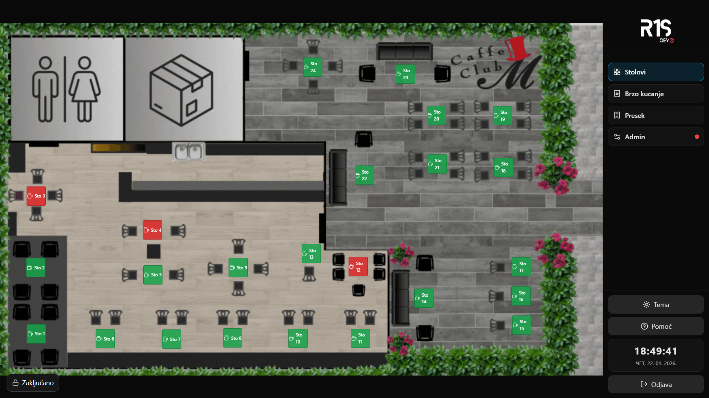
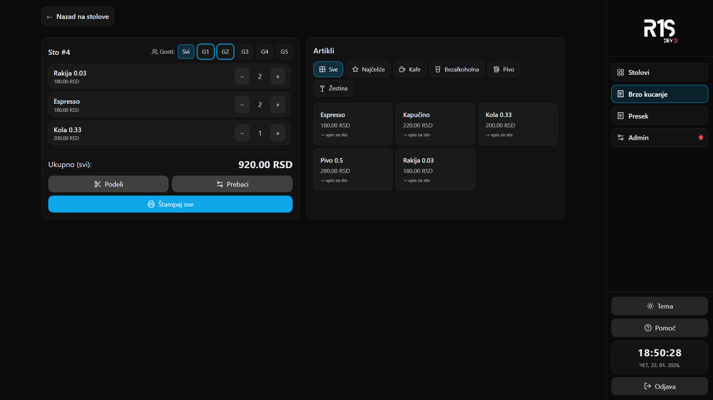

# 🧾 R1S POS

Web POS aplikacija za izdavanje računa i upravljanje prodajom u ugostiteljskim i maloprodajnim objektima.  
Razvijena kao **Progressive Web App (PWA)**, aplikacija je namenjena **realnoj svakodnevnoj upotrebi**, sa punom podrškom za računare, tablete i POS touch uređaje.

🔗 **Live demo:**  
👉 https://r1s-pos.vercel.app/

---

## 📸 Pregled aplikacije

### Glavni POS ekran


### Ekran za kucanje računa


> Aplikacija podržava **Light / Dark temu**, optimizovana je za **touch screen** rad  
> i namenjena je korišćenju na tabletima i POS touch računarima.

---

## ⚙️ Funkcionalnosti

### Rad sa računima
- Brzo kucanje i izdavanje računa
- Ručna izmena cena po stavci
- Automatski obračun ukupnog iznosa
- Print-friendly prikaz računa
- Offline rad (bez internet konekcije)

### Podela i upravljanje računima
- **Podela računa po gostima** (više gostiju za jednim stolom)
- Prebacivanje pojedinačnog gosta na drugi sto
- Prebacivanje **celog stola** na drugi sto
- Fleksibilno upravljanje aktivnim računima u realnom vremenu

### Izveštaji
- **Dnevni izveštaj prodaje**
- Pregled ukupnog prometa
- Evidencija izdatih računa po danu

### Artikli
- Upravljanje artiklima (naziv, cena)
- **Import artikala putem CSV fajla**
- Brze opcije za unos i selekciju stavki

### Stolovi i raspored
- Vizuelni prikaz rasporeda stolova
- **Ručno menjanje pozicija stolova**
- Upravljanje statusom stolova i aktivnih računa

### Admin opcije
- Administratorski režim rada
- Ručne izmene cena i stavki
- Upravljanje rasporedom stolova
- Kontrola aplikacionih podešavanja

### Tema i interfejs
- **Light / Dark tema**
- Touch-friendly dizajn
- Prilagođeno radu na:
  - tabletima
  - POS touch računarima
  - desktop uređajima

### PWA podrška
- Instalacija aplikacije na uređaj
- Fullscreen režim rada
- Lokalno čuvanje svih podataka

---

## 🧩 Tehnologije

- **[React](https://react.dev/)** – korisnički interfejs  
- **[TypeScript](https://www.typescriptlang.org/)** – tipizacija i stabilnost koda  
- **[Tailwind CSS](https://tailwindcss.com/)** – stilizacija i responsive dizajn  
- **[Vite](https://vitejs.dev/)** – razvojni i build alat  
- **[IndexedDB](https://developer.mozilla.org/en-US/docs/Web/API/IndexedDB_API)** (Dexie.js) – lokalna baza podataka  
- **[Progressive Web Apps](https://developer.mozilla.org/en-US/docs/Web/Progressive_web_apps)** – offline rad i instalacija aplikacije  

---

## 🏗️ Arhitektura i rad sa podacima

- Potpuno klijentska aplikacija (bez backend-a)
- **Local-first** pristup (IndexedDB)
- Svi podaci ostaju na uređaju korisnika
- Modularna i proširiva arhitektura
- Optimizovano za brz i stabilan rad u realnom okruženju

---

## 🚀 Pokretanje lokalno

```bash
git clone https://github.com/R1S-dev/R1S-POS.git
cd R1S-POS
npm install
npm run dev
